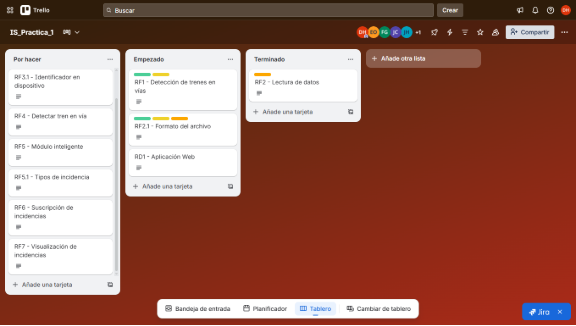
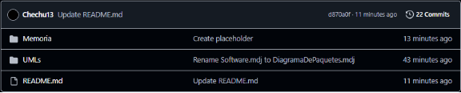
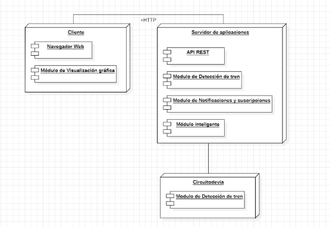
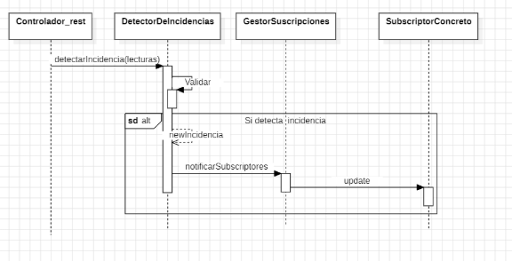


`  `

Grado en Inteligencia Artificial

\
\
\

**Práctica 1 Ingeniería Del Software**

\
\
Víctor Bravo Vivas, Jorge Higuera Herrero, David Hernández Esteban,

` `Jesús Humanes Cuadrado, Eneas Ramírez Ocaña, Francisco Jiménez.

**Curso 2025-2026**
**\

# **Índice**
[Integrantes y Roles	3](#_toc214824799)

[Jefe de Proyecto: David Hernández Esteban	3](#_toc214824800)

[Analistas Software: Víctor Bravo Vivas, Eneas Ramírez Ocaña.	3](#_toc214824801)

[Arquitectos Software: Jesús Humanes Cuadrado, Jorge Higuera Herrero, Francisco Jiménez Gómez	3](#_toc214824802)

[Metodología de trabajo y herramientas de apoyo	4](#_toc214824803)

[Requisitos Funcionales (RF)	7](#_toc214824804)

[Requisitos de Dominio (RD)	8](#_toc214824805)

[Diseño del Sistema (UML)	9](#_toc214824806)

[Resultados y Análisis	14](#_toc214824807)

[Conclusiones	15](#_toc214824808)

[Bibliografía	16](#_toc214824809)

# **Integrantes y Roles**
## **Jefe de Proyecto: David Hernández Esteban**
Email: d.hernandeze.2023@alumnos.urjc.es

Rol: Coordina a analistas y arquitectos de software. Debe elegir Scrum o Kanban y documentar el resultado. Usar herramienta de metodología ágil.
## **Analistas Software: Víctor Bravo Vivas, Eneas Ramírez Ocaña.**
Email: e.ramirezo.2023@alumnos.urjc.es, v.bravo.2023@alumnos.urjc.es

Rol: Interpretan e identifican requisitos (RF, RD), capturándolos en tablas con número, nombre corto y descripción detallada.
## **Arquitectos Software: Jesús Humanes Cuadrado, Jorge Higuera Herrero, Francisco Jiménez Gómez**
Email: j.higuera.2023@alumnos.urjc.es, j.humanes.2023@alumnos.urjc.es, f.jimenezg.2023@alumnos.urjc.es

Rol: Modelan diagramas UML: clases, paquetes, despliegue y secuencia de funcionalidades dinámicas.

# **Metodología de trabajo y herramientas de apoyo**
Para la gestión de la carga de trabajo se ha optado por la metodología **Kanban**, la cual permite organizar las tareas de manera visual y flexible, priorizando la entrega continua de valor y la adaptación a cambios. Kanban se adapta mejor a nuestra diferencia de horarios y tiempos de trabajo permitiéndonos avanzar de manera constante en el trabajo sin tener que estar completamente sincronizados.

Como herramienta de apoyo se ha utilizado [**Trello**](https://trello.com/), una plataforma de Atlassian basada en tableros, listas y tarjetas que permite aplicar Kanban de manera sencilla y visual. 

Aprovechando las capacidades de Trello, hemos usado etiquetas para saber que integrantes sepan quien esta realizado cada tarea.

**Fig. **1****

**Repositorio del proyecto**

Para el control de versiones hemos decidido usar GitHub, por su versatilidad y uso extendido.

[Repositorio del proyecto](https://github.com/Daby7777/IS_Practica_1) 

La estructura de carpetas del proyecto consiste en:

\

**Fig. **2****

Donde en la carpeta memoria reside el PDF de la memoria. En la carpeta UMLs tenemos todos los archivos .mdj creados en starUML y el README.md con la descripción del proyecto.

**Presentación del problema**

Se requiere analizar y diseñar un sistema para el siguiente caso de estudio.

El transporte ferroviario dispone de elementos eléctricos de alta y baja tensión. En concreto, las vías de tren disponen de unos dispositivos que envían señales eléctricas en voltios para saber si un tren está ocupando o no la vía. En función de esos valores es posible que surjan incidencias que hay que detectar y predecir. En este sentido, el software que se pretende diseñar es una aplicación Web basada en protocolos HTTP/REST y debe contar con las siguientes funcionalidades:

- Un elemento que lea los valores de voltajes de las vías desde un fichero CSV con la hora en formato (HH:MM:SS:MS) y un valor binario (0/1) que indica el estado. Por cada de tren pueden existir múltiples dispositivos cada cierto número de metros. Cada dispositivo debe llevar un identificador.

- Una funcionalidad que detecte si hay un tren en la vía en función del valore binario (1: libre, 0: hay un tren)

- Un módulo inteligente que detecte y sea capaz de predecir tipos de incidencias en función de los valores. De los tipos posibles solo vamos a considerar los siguientes: (i)ausencia de datos por bloqueo prolongado donde un dispositivo de vía no emite datos por un periodo de más de 2 minutos, (ii) saltos de frecuencia de al menos 0.5 voltios.

- Un módulo de suscripción a incidencias por parte de los usuarios del sistema donde se pueden publicar diferentes tipos de incidencias.

- Un módulo de visualización que muestre gráficamente las incidencias en función de los valores de los voltajes.
# **Requisitos Funcionales (RF)**

Son los servicios y funciones que proporciona un sistema y que reaccionan ante una entrada o estímulo y proporcionan una salida.

|RF1|Detección de trenes en vías|Las vías de tren disponen de unos dispositivos que envían señales eléctricas en voltios para saber si un tren está ocupando o no la vía. En función de esos valores es posible que surjan incidencias que hay que detectar y predecir.|
| :- | :- | :- |
|RF2|Lectura de datos|El sistema debe contar con un módulo que lea los valores de las vías desde un fichero CSV.|
|RF2.1|Formato del archivo|En el archivo CSV la hora deberá seguir el formato (HH:MM:SS:MS) y para representar si un tren está o no en la vía se deberá usar un valor binario (0/1).|
|RF3|Dispositivos en vía|Para cada vía de tren pueden existir múltiples dispositivos cada cierto número de metros.|
|RF3.1|Identificador en dispositivo|Cada dispositivo debe llevar un identificador único que lo distinga del resto.|
|RF4|Detectar tren en vía|Una funcionalidad que detecte mediante los valores binarios (0: No hay tren en vía/1: Hay tren en vía) si hay un tren en esa vía.|
|RF5|Módulo inteligente|De todos los tipos de incidencias sólo se deberán recoger las siguientes: (i) Para la primera incidencia se deberá detectar si existe una ausencia de datos por bloqueo prolongado donde un dispositivo de vía no emite datos por un período de más de 2 minutos. (ii) Para la segunda incidencia se deberá detectar si existen saltos de frecuencia de al menos 0.5 voltios.|
|RF5.1|Tipos de incidencia|Se deberá crear un módulo de suscripción a incidencias por parte de los usuarios del sistema donde se puedan publicar diferentes tipos de incidencias.|
|RF6|Suscripción de incidencias|Describir módulo de suscripción para usuarios.|
|RF7|Visualización de incidencias|Se deberá crear un módulo de visualización que muestre gráficamente las incidencias en función de los valores de los voltajes.|

**Fig. **3****

# **Requisitos de Dominio (RD)**

Son restricciones técnicas, legales o de otra naturaleza que condicionan la ejecución del sistema en el entorno en el que opera.

|RD1|Aplicación Web|El software que se pretende diseñar es una aplicación Web basada en protocolos HTTP/REST.|
| :- | :- | :- |

**Fig. **4****

# **Diseño del Sistema (UML)**

**DIAGRAMA DE CLASES Y PAQUETES:**

![ref1]

**Fig. **5****

Para dar respuesta a los requisitos del sistema de monitorización ferroviaria, hemos diseñado una arquitectura distribuida y desacoplada, organizada en dos paquetes principales: Cliente y Servidor. Esta estructura obedece estrictamente a la necesidad planteada en el enunciado de desarrollar una aplicación Web basada en protocolos HTTP/REST. El punto neurálgico de comunicación entre ambos extremos es la clase Controlador\_rest. Este componente no solo actúa como interfaz para recibir las peticiones externas mediante el protocolo HTTPS, sino que también aísla la lógica de negocio del servidor respecto a la interfaz de usuario, garantizando un diseño más limpio y seguro.

En el núcleo del servidor, la lógica se centra en la correcta digitalización del entorno físico. Hemos modelado la clase Dispositivo para representar el hardware instalado en las vías, el cual mantiene una relación de uno a muchos (1 a 0\*) con la clase Lectura. Esta decisión de diseño permite que un solo dispositivo almacene un histórico completo de mediciones. La clase Lectura es fundamental, ya que encapsula los métodos leerCSV() y detectarTren(), encargados de procesar los datos brutos provenientes del fichero (hora, voltaje y valor binario). De este modo, el sistema puede determinar automáticamente si la vía está libre o si hay un tren presente (valor 0) basándose en la entrada de datos.

Uno de los puntos críticos del sistema es el módulo inteligente de predicción de fallos. Para ello, hemos diseñado la clase DetectorDeIncidencias, que monitoriza constantemente los objetos Lectura. Para gestionar la casuística de errores, hemos optado por un patrón de herencia encabezado por la clase abstracta Incidencia, la cual define atributos comunes como dispositivoAfectado y hora. De esta clase padre derivan dos especializaciones concretas: IncidenciaBloqueo, para detectar la ausencia de datos por más de 2 minutos, e IncidenciaVoltaje, encargada de identificar saltos de frecuencia superiores a 0.5 voltios. Este diseño extensible permite incorporar nuevas reglas de negocio en el futuro sin alterar la estructura base.

Para cumplir con los requisitos de interacción con el usuario, el diseño integra un sistema de suscripciones y visualización. En el servidor, hemos implementado el comportamiento dinámico mediante la clase GestorSuscripciones y la interfaz Usuario. Este esquema permite que, mediante los métodos addSubscriptor y notificarSubscriptores, los usuarios reciban alertas en tiempo real sobre las incidencias publicadas. Por parte del Cliente, la arquitectura delega la representación gráfica en el componente ClienteApi, el cual integra la librería externa Chart.js. Esta dependencia es clave para transformar los datos numéricos de voltaje en gráficas visuales comprensibles para el operario, cerrando así el ciclo de monitorización exigido.

![Diagrama

El contenido generado por IA puede ser incorrecto.]

**Fig. **6**: Observer**

**DIAGRAMA DE DESPLIEGUE:**

**Fig. **7****

En el diagrama de despliegue hemos optado por una estructura con dos componentes principales Cliente-Servidor y el componente de Circuito de vía del cual no se especifica numero ni conexión ya que no se sabe cuántos son ni como se conectan. El núcleo de la estructura es el servidor ya que recibe los datos del Circuito de vía los procesa y está conectado con el cliente de manera bidireccional. Analizando el diagrama por partes tenemos:

El Servidor de Aplicaciones es el núcleo funcional. Contiene la API REST para gestionar peticiones del cliente y el Módulo Inteligente para procesar la lógica crítica, lo que incluye la detección y predicción de incidencias específicas, como la ausencia de datos (> 2 minutos) y los saltos de frecuencia (> 0.5 voltios).

El Cliente se enfoca exclusivamente en la presentación de los datos y la interfaz para el usuario. La conexión bidireccional entre el Cliente y el Servidor es crucial para que este último pueda "empujar" las alertas en tiempo real al navegador.

Finalmente, el Circuito de Vía actúa como la capa física, leyendo y reportando valores de voltaje y estado binario al Servidor, cuya conexión no se especifica.

**DIAGRAMA DE SECUENCIA.**\

**Fig. **8****

Tras definir la estructura estática en el diagrama de clases y la topología física en el diagrama de despliegue, hemos elaborado este diagrama de secuencia para modelar el comportamiento dinámico del **Servidor de Aplicaciones**. El objetivo principal es detallar cómo interactúan los objetos del sistema ante la llegada de nuevas lecturas desde el Circuito de Vía, centrándonos en el caso de uso crítico: la detección de una anomalía y su posterior comunicación en tiempo real.

El flujo de interacción se ha diseñado separando las responsabilidades en cuatro líneas de vida (*lifelines*), lo que garantiza un bajo acoplamiento entre la lógica de negocio y la gestión de comunicaciones.
#### ***1. Recepción y Delegación (Controlador\_rest)***
El proceso se inicia en el Controlador\_rest. En consonancia con el diagrama de despliegue, este componente actúa como la interfaz de la API REST. Hemos limitado su responsabilidad estrictamente a la recepción de la petición externa (detectarIncidencia) y su delegación inmediata al módulo de negocio. De esta forma, aislamos la capa de red de la lógica de análisis.
#### ***2. Lógica de Negocio y Validación (DetectorDeIncidencias)***
El núcleo del procesamiento recae sobre el objeto DetectorDeIncidencias, el cual se corresponde con el "Módulo Inteligente" descrito anteriormente.

- **Auto-validación (Validar):** Hemos encapsulado la complejidad algorítmica en una auto-llamada interna denominada Validar. Es en este punto donde se aplican las reglas definidas en los requisitos (detección de ausencia de datos > 2 minutos o saltos de voltaje > 0.5V).
- **Manejo Condicional (alt):** Para optimizar el rendimiento del servidor, hemos introducido un fragmento combinado alt. El sistema solo procede a la creación de objetos y notificación si la validación confirma un error positivo. En caso contrario, el flujo termina silenciosamente, evitando consumo innecesario de recursos.
- **Instanciación (newIncidencia):** Si se confirma el fallo, el detector instancia un nuevo objeto (representado por la flecha de creación). Esto se correlaciona directamente con el diagrama de clases, donde se generarían instancias concretas de IncidenciaBloqueo o IncidenciaVoltaje.
#### ***3. Notificación Desacoplada (Patrón Observer)***
Finalmente, para cumplir con el requisito de "empujar" alertas al Cliente sin que el detector conozca los detalles de la interfaz de usuario, hemos aplicado el patrón de diseño *Observer*:

- **Delegación al Gestor:** El detector envía el mensaje notificarSubscriptores al GestorSuscripciones.
- **Difusión (update):** El gestor recorre su lista interna de observadores y emite el mensaje update hacia el SubscriptorConcreto.
#### ***Justificación del Diseño***
Hemos optado por esta arquitectura secuencial para garantizar la **separación de conceptos**. Al desacoplar el DetectorDeIncidencias (que sabe *qué* ha pasado) del SubscriptorConcreto (que sabe *a quién* avisar), conseguimos un sistema más robusto. Si en el futuro se requiere modificar el canal de comunicación (por ejemplo, añadir notificaciones por email además de las alertas web), podremos hacerlo extendiendo los suscriptores sin necesidad de alterar la lógica - de detección de fallos en la vía.

#

# **Resultados y Análisis**

El desarrollo de la práctica ha dado como resultado principal la definición de una arquitectura de software completa para la monitorización ferroviaria, sustentada en una gestión de equipo ágil mediante la metodología Kanban y el uso de herramientas como Trello y GitHub para asegurar la trazabilidad de las tareas y el control de versiones. Como base del proyecto, se identificaron y documentaron siete requisitos funcionales clave y una restricción de dominio, los cuales dictaron la necesidad de diseñar una aplicación Web basada en protocolos HTTP/REST para la detección y predicción de incidencias en las vías.

El análisis técnico de la solución se refleja en los modelos UML diseñados, donde se destaca una arquitectura distribuida que separa claramente la lógica del Servidor de la visualización en el Cliente. En el diseño estático, la implementación del patrón Observer mediante la clase GestorSuscripciones resultó fundamental para desacoplar la detección de fallos del sistema de notificaciones, permitiendo una escalabilidad futura sin alterar el núcleo del programa. Finalmente, el diagrama de secuencia validó la viabilidad del comportamiento dinámico, demostrando que el flujo diseñado optimiza los recursos al iniciar procesos de notificación únicamente cuando la validación interna confirma una incidencia real.

\

# **Conclusiones**

Durante el desarrollo de la práctica fuimos capaces de identificar los siguientes puntos clave en el desarrollo software:

- Los errores de análisis resultan muy impactantes en las posteriores fases de desarrollo por eso es fundamental una correcta captura de requisitos.
- El uso de patrones nos permite un mejor desarrollo y diseño en los esquemas UML
- Es necesaria la sincronización e iteración entre las distintas partes, haciendo imprescindible la figura de jefe de proyecto.
- Las metodologías agiles, y en este caso Kanban nos permiten aprovechar al máximo el tiempo y recursos disponibles aumentando la eficiencia total del equipo.
- Distintas fases del desarrollo conllevan más trabajo para los distintos integrantes por eso es importante que cada uno tenga claro su rol.

**Bibliografía**\

============================================
Atlassian. (2025). *Trello*. Recuperado de <https://trello.com/>

Hernández Esteban, D., Bravo Vivas, V., Higuera Herrero, J., Humanes Cuadrado, J., Jiménez Gómez, F., & Ramírez Ocaña, E. (2025). *IS\_Practica\_1* [Repositorio GitHub]. Recuperado de <https://github.com/Daby7777/IS_Practica_1>

Itnove. (2025). *¿Qué roles son necesarios para los equipos Kanban?* Recuperado de <https://itnove.com/blog/kanban/que-roles-son-necesarios-para-los-equiposkanban/>

Refactoring Guru. (2025). *Patrones de diseño*. Recuperado de <https://refactoring.guru/es/design-patterns/>

[ref1]: Aspose.Words.408fbffe-b2d9-4bfd-9220-5735acc58580.004.png
[Diagrama

El contenido generado por IA puede ser incorrecto.]: Aspose.Words.408fbffe-b2d9-4bfd-9220-5735acc58580.005.png
